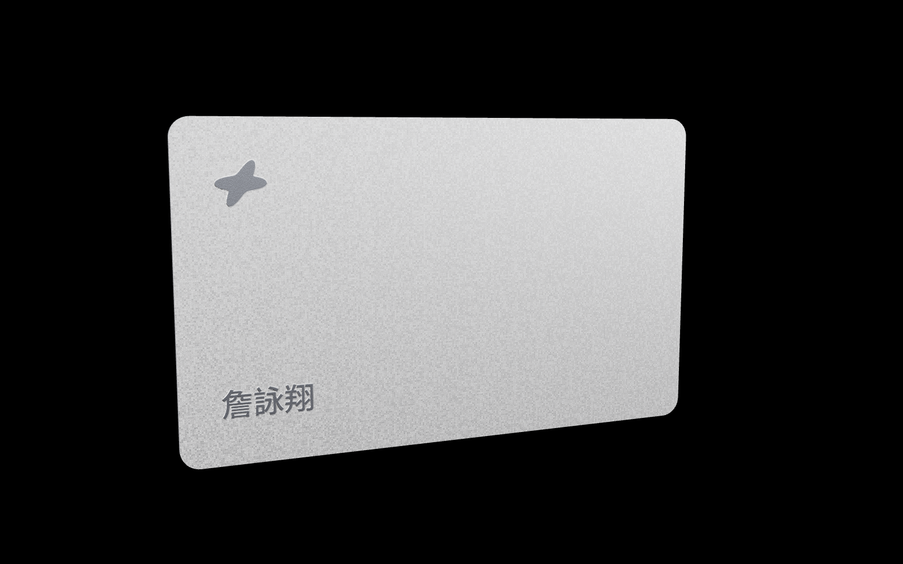

```
 ██████╗ █████╗ ██████╗ ██████╗
██╔════╝██╔══██╗██╔══██╗██╔══██╗
██║     ███████║██████╔╝██║  ██║
██║     ██╔══██║██╔══██╗██║  ██║
╚██████╗██║  ██║██║  ██║██████╔╝
 ╚═════╝╚═╝  ╚═╝╚═╝  ╚═╝╚═════╝
```

# card

> An embossed white titanium business card you can pick up, turn over and hold to the light.

[](#license)

Handing someone a link is easy; handing them something that feels like an object is not. A metal card has weight, a milled rim, a blasted coating that catches the light in a band rather than a point, and none of that survives a flat PNG. This page renders the real thing instead: 90 x 54 x 0.76 mm of titanium under a white ceramic coating, every mark standing 0.06 mm proud of it in bare metal, lit in a studio, running on your GPU.


<sub>The default `titanium` preset: sandblasted white coating, brushed along the long axis, marks raised in bare metal.</sub>

## Features

- **Hold a real card**: true millimetre dimensions, a 3.18 mm ID-1 corner radius and a 0.76 mm milled rim you can rake the light across.
- **Raised, not printed**: the design texture's alpha is a mark mask, so every mark is bare titanium standing proud of the coating, with its own roughness, metalness, lit top edge and contact shadow. `reliefDepth` is signed, so the same marks can be etched back into the coating by flipping it negative.
- **Turns with the window**: a viewport taller than it is wide rolls the card a quarter turn clockwise and reframes it to 85% of the width, easing over 0.4 s rather than snapping, while the idle spin stays a horizontal turn.
- **Brushed metal, properly**: an anisotropic GGX lobe along the card's long axis, with the studio environment stretched to match, so softboxes smear into horizontal bands.
- **Lit by your cursor**: a fourth light hangs 120 mm in front of the card and follows the pointer, so the coating carries a soft warm pool that glides instead of a fixed highlight.
- **Arrives, does not appear**: on load the card swings in from edge-on over 1.6 s while the canvas fades up, then settles into its slow turn. Touch it and the intro gets out of the way.
- **Compare four finishes**: `?preset=titanium` is the default; `?preset=paper`, `?preset=soft-touch` and `?preset=gloss` swap the whole material back to printed stock.
- **Prove the render without a GPU**: a headless script renders every preset to PNG and asserts on the pixels, so a shader change cannot quietly break the look.

## Tech stack

| Layer           | Choice                             |
| --------------- | ---------------------------------- |
| Framework       | Next.js 16 (App Router)            |
| Rendering       | vgpu 0.5.0 (WebGPU)                |
| Styling         | Tailwind CSS v4 + shadcn/ui tokens |
| Package manager | Bun                                |

## Getting started

```bash
git clone https://github.com/zyx1121/card && cd card
bun install
bun dev
```

Open [localhost:3000](http://localhost:3000) in a browser with WebGPU, and drag
the card to orbit it. No environment variables, no backend.

## Editing the card

Everything marked on the card lives in [`lib/card-content.ts`](lib/card-content.ts),
positioned in millimetres on the real 90 x 54 mm face. The blank itself is
[`CARD_DIMENSIONS`](lib/card-spec.ts) and the material presets are in
[`lib/card-presets.ts`](lib/card-presets.ts).

## Verifying a render

`next build` never validates WGSL, so shaders have their own gates:

```bash
bun run check:wgsl   # vgpu check --require-validation on every shader
bun run fonts        # one-off: fetch and instance the fonts the renderer needs
bun run render       # headless PNGs into renders/, plus pixel assertions
```

`bun run render` shoots a hero, a back and a rim macro per preset. It prints the
measured silhouette aspect and width, the mark-versus-coating contrast, the
luminance gradient across the bare face, the speckle left once that gradient is
filtered out, the aspect ratio of the brightest highlight (which is how the
anisotropy is checked), the rim-versus-face step and the mean luminance of the
band under the card. A single frame is available with
`--view hero|back|edge|macro`.

More flags cover what a single still frame cannot show on its own:

```bash
bun run scripts/render.ts --view hero --yaw 70               # steep three-quarter, where the milled rim opens up
bun run scripts/render.ts --view hero --pointer 0.62,0.45    # cursor light on, at 62% across and 45% down
bun run scripts/render.ts --view macro                       # the name at 4x, where the raised bevel is readable
bun run scripts/render.ts --view hero --width 900 --height 1600  # portrait, where the card rolls upright
```

## Deploy

Push to `main` and Vercel does the rest.

## Contributing

Issues and PRs welcome: start with [CONTRIBUTING.md](https://github.com/zyx1121/.github/blob/main/CONTRIBUTING.md).

## License

[MIT](LICENSE) · The card weighs nothing and still bills for the titanium.
